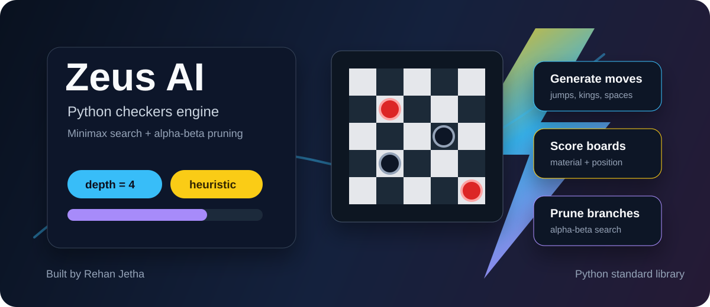
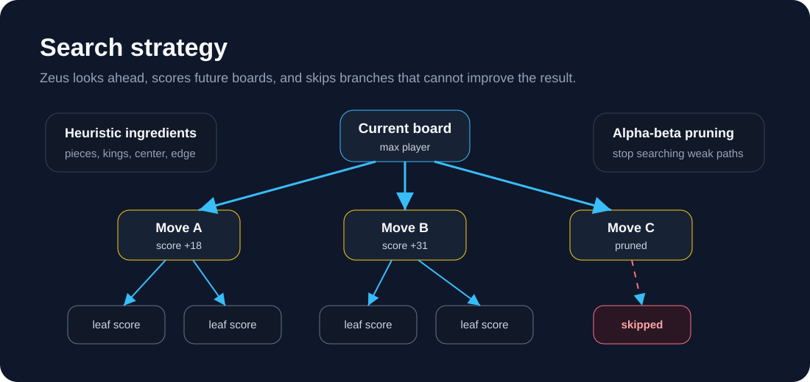
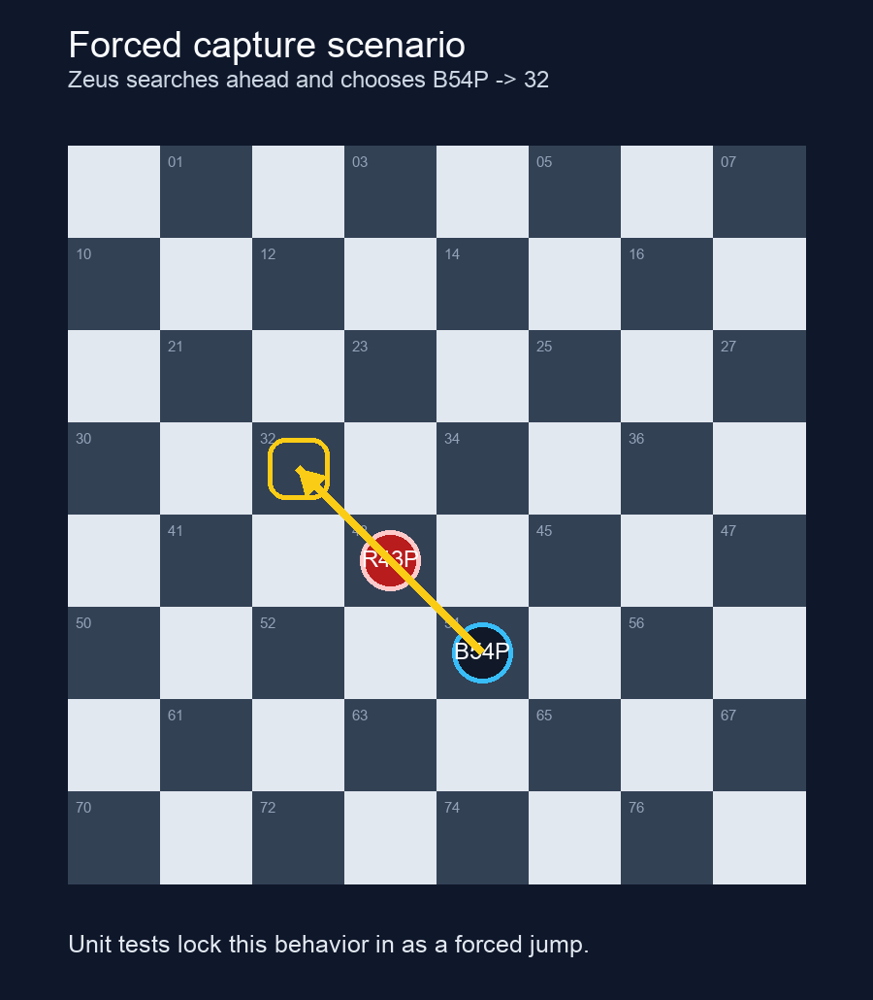

<p align="center">
  
</p>

# Zeus AI


Zeus AI is a Python checkers project built around a minimax-based player with
alpha-beta pruning. It was made to test a custom checkers move engine against a
simple random baseline and measure how well a deeper search strategy performs.

The project is intentionally small: `Player9.py` contains the Zeus move logic,
`PlayerRandom.py` provides a baseline opponent, and `CheckersSim.py` runs a
batch of simulated games between the two.

## At a Glance

| Area | What it does |
| --- | --- |
| Move generation | Finds legal movement, jumps, chained captures, and king movement |
| Search | Looks ahead with depth-limited minimax |
| Pruning | Uses alpha-beta pruning to skip branches that cannot improve the result |
| Heuristic | Scores boards using material, kings, promotion progress, center control, and edge control |
| Simulation | Runs repeated games against a random baseline player |

## Search Flow

<p align="center">
  
</p>

## Simulation Preview

<p align="center">
  
</p>

## Project Structure

```text
zeus-ai/
├── CheckersSim.py   # Simulation runner
├── Player9.py       # Zeus AI player
└── PlayerRandom.py  # Random baseline player
```

## Running the Simulation

This project uses only the Python standard library.

Run the simulator with:

```bash
python CheckersSim.py
```

By default, `CheckersSim.py` runs 100 games between Zeus and the random player,
then prints the win and draw totals.

## Testing

Run the automated unit tests with:

```bash
python -m unittest discover -s tests
```

The tests cover forced captures, no-move handling, input-board immutability, and
deterministic behavior for the random baseline.

## How the AI Works

Zeus evaluates possible moves by searching ahead with minimax. On each turn, it
generates legal checkers moves, simulates future board states, scores each board,
and chooses the strongest move found at the configured search depth.

The board score rewards useful positions such as owned pieces, kings, pieces
closer to promotion, center control, and edge control. Opponent pieces and
strong opponent positions reduce the score.

## Notes

This is a compact project focused on checkers AI logic rather than a full
graphical game. The board is represented as nested Python lists, and pieces are
encoded as strings containing their color, position, and rank.

## License

This project is source-available for portfolio review and personal learning. It
is not licensed for commercial use, resale, redistribution, or incorporation
into another product without written permission.

See `LICENSE` for the full terms.
